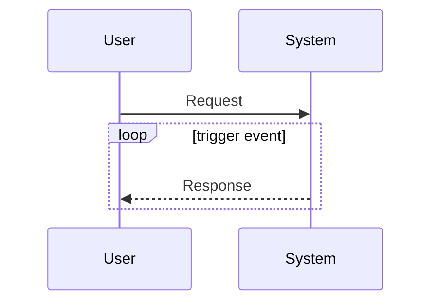
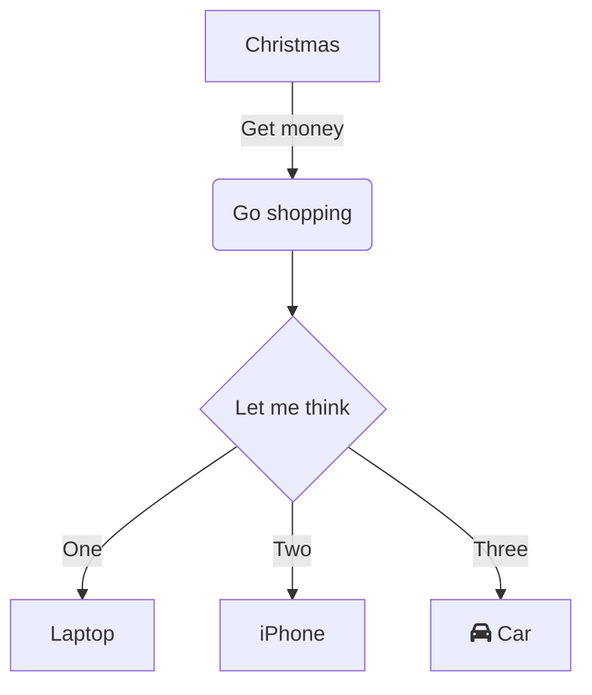

<!-- markdownlint-disable MD024 MD041 MD043 MD033 -->

<!--  -->

<!--  -->
<!-- 
 -->
<!--    -->
<!-- 
 -->

# 《專案指引》

## 簡介

本文件舘，用於彙集本專案之各類文件。

## 主要文件類別

- [使用者需求規格](./d100_URS/)
- [應用系統需求規格](./d200_SRS/)
- [應用系統設計規格](./d300_SDD/)
- [應用系統驗證規格](./d400_DEV/)
- [維運管理及操作手冊](./d500_OP/)
- [文件管理作業指引](./d500_OP/doc_lib)

## Mermaid 支援

### 循序圖

<!-- markdownlint-disable line-length -->
<mermaid/>

<!-- markdownlint-enable line-length -->

### 流程圖

<mermaid/>

## 作業提示

一般作業提示：

::: tip

作業執行時的工作要點、概念解釋，將置於此處說明。

:::

危險作業提示：

::: danger

作業執行將致資料移除、或有可能導致系統當機，以上均屬危險作業
。執行時需小心、再小心。

:::

