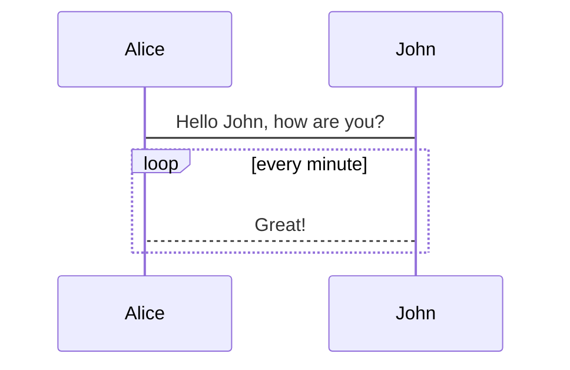
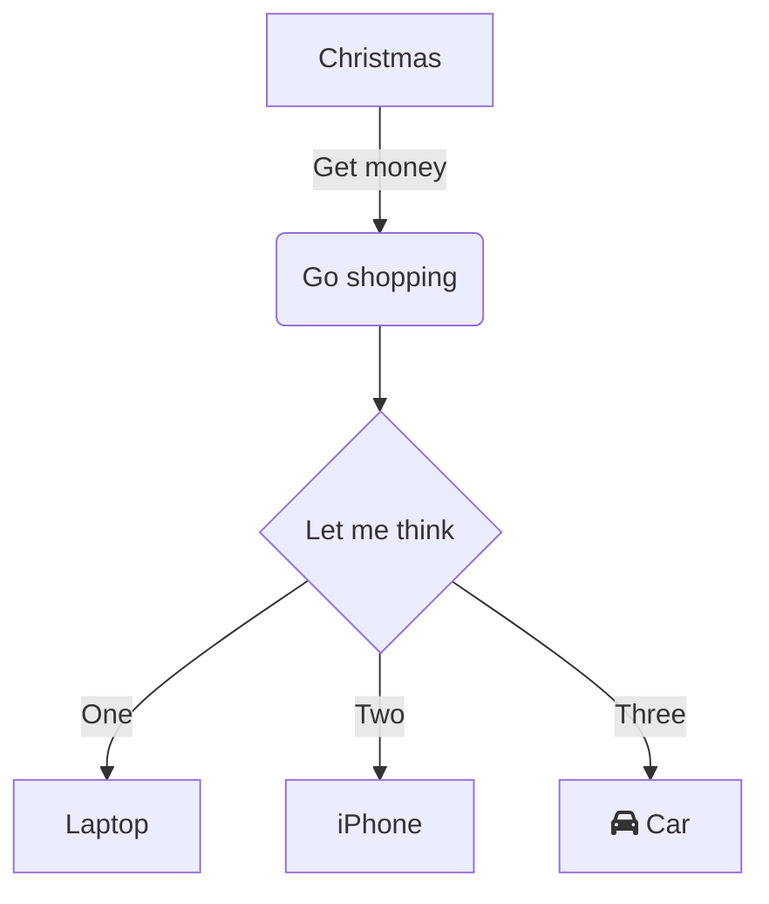

# 《專案指引》

## 簡介

本文件舘，用於彙集本專案之各類文件。

## 主要文件類別

- [使用者需求規格](./d100_URS/)
- [應用系統需求規格](./d200_SRS/)
- [應用系統設計規格](./d300_SDD/)
- [應用系統驗證規格](./d400_DEV/)
- [維運管理及操作手冊](./d500_OP/)

## Mermaid 支援

### 循序圖

### 流程圖

