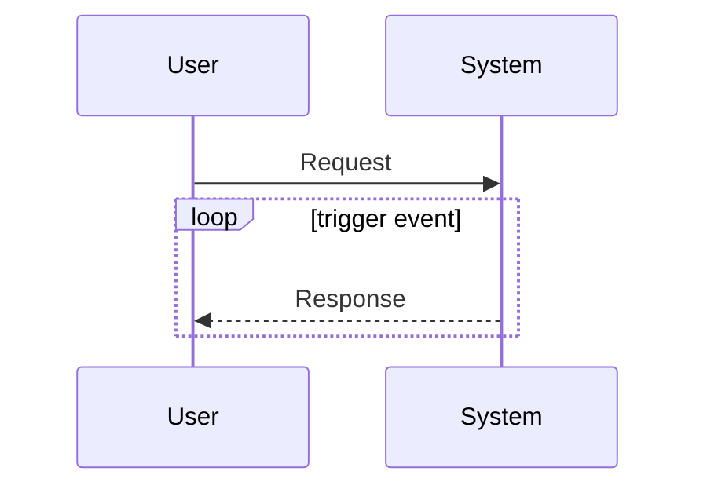
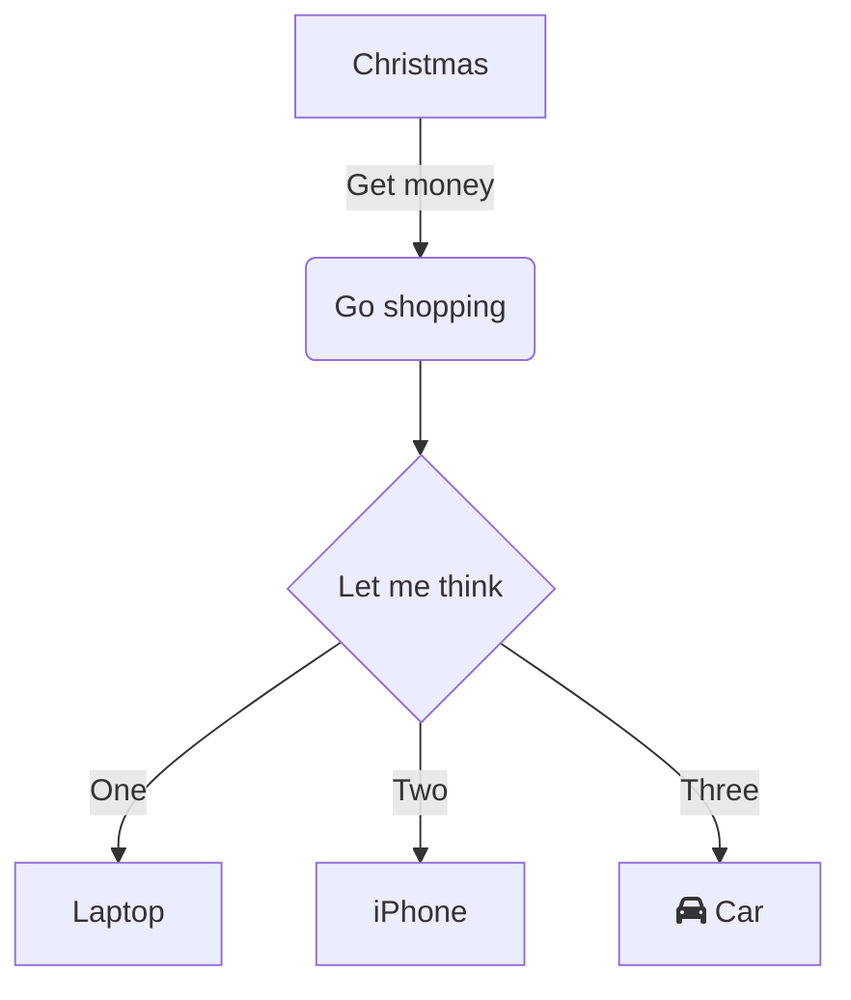

<!-- markdownlint-disable MD024 MD041 MD043 MD033 -->

<!--  -->

<!--  -->

  

# 《專案指引》

## 簡介

本文件舘，用於彙集本專案之各類文件。

## 主要文件類別

- [使用者需求規格](./d100_URS/)
- [應用系統需求規格](./d200_SRS/)
- [應用系統設計規格](./d300_SDD/)
- [應用系統驗證規格](./d400_DEV/)
- [維運管理及操作手冊](./d500_OP/)
- [文件管理作業指引](./d500_OP/doc_lib)

## Mermaid 支援

### 循序圖

@startuml
actor User
control Django.Router as Router
control Django.Template as Template
boundary post_detail as View
boundary CommentForm as Form
entity Post as Model
entity Comment as Comment
database database as DB

User -> Router : url: /blog/ (post_detail)
Router -> View : post_detail(request, year, month, day, post)
View -> Model : get_object_or_404(Post, slug=post, \n status='published', publish**year=year, \n publish**month=month, publish\_\_day=day)
Model -> DB : sql_query()
DB --> Model : post
Model --> View : post
View -> Comment: post.comments.filter(active=True)
Comment --> View: comments
View -> Form: CommentForm()
Form --> View: form
View --> Template: render(request, \n uri_of_template, \n {post, comments, form})
Template --> User: /blog/post/list.html
@enduml
<mermaid/>

### 流程圖

<mermaid/>

## 指定色彩

::: tip
This is a tip message.
:::

::: danger
This is a danger message.
:::

