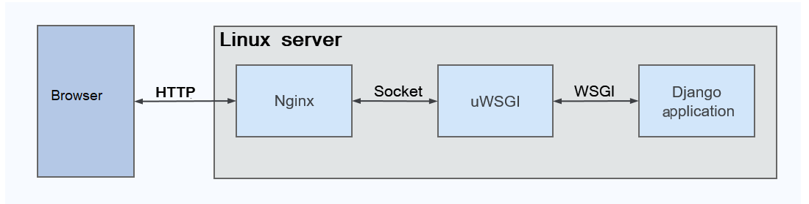

# Django 應用系統佈署指引

## 摘要

說明如何在 Ubuntu 作業系統，佈署 Django 應用系統。

本指引文件共分兩篇：
 - 建置 Django 應用系統運作平台
 - 佈署 Django 應用系統作業指引

### 組成 Django 應用系統所需服務

Django Application 之運作，將由下列之服務(Services)協同作業：

- HTTP Service: 由 Ngnix 擔綱，作為 HTTP Server ；
- Application Service: 由 uWSGI（Web Server Gateway Interface） 作為 Application Server 。

### Django 應用系統作業流程



1. Web Client 發送 HTTP Request；

2. HTTP Service (Nginx) 於收到 HTTP Request 後，將提供「靜態檔案」 (Static Files) 予 Web Client ；或是將 HTTP Request 打包成：「檔案類型」 之 Unix Socket ，然後轉交 Application Service (uWSGI) 處理；

3. Application Service 自檔案讀取 Unix Socket 內容，並轉發予 Django Application 處理此發自 Web Client 端之 HTTP Request。

## 作業指引

### [建置 Django 應用系統運作平台](./deploy-django-app-s01.md)

說明如何在 Ubuntu 作業系統，建置 Django 應用系統於執行時期，
所需使用之運作平台。

### [佈署 Django 應用系統作業指引](./deploy-django-app-s02.md)

說明 Django 應用系統，「首度」佈署之作業程序。

## 問題診斷與狀況排除

### 常用服務管理指令

```
sudo service nginx status
sudo service nginx stop
sudo service nginx start
```

### 驗證設定檔語法正確

建立或變更 nginx.conf 、虛擬網站設定檔後，可使用如下指令驗證有無「設定語法」的 錯誤。

```
sudo nginx -t
```

📺

```
$ sudo nginx -t
nginx: the configuration file /etc/nginx/nginx.conf syntax is ok
nginx: configuration file /etc/nginx/nginx.conf test is successful
```


## 參考資料

### [Setting up Django and your web server with uWSGI and nginx](https://uwsgi-docs.readthedocs.io/en/latest/tutorials/Django_and_nginx.html?fbclid=IwAR2NF6La2CNVljdTPr79dg4zy9S91e0pkyHqp8zTkj0DihpLrGoL04-lyzc)

如何使用 Nginx + uWSGI 佈署 Django 應用系統。 

### [How To Set Up uWSGI and Nginx to Serve Python Apps on CentOS 7](https://www.digitalocean.com/community/tutorials/how-to-set-up-uwsgi-and-nginx-to-serve-python-apps-on-centos-7)

如何運用作業系統所提供之功能，令 Django 應用系統於「開機」後自動啟動，開始提供服務。

