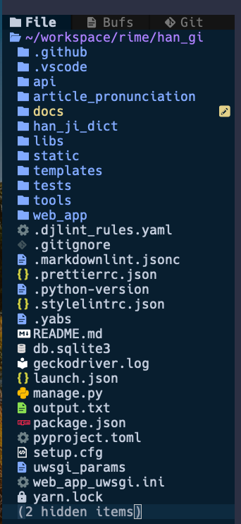

<!-- markdownlint-disable MD024 MD043 -->

# 建置作業程序

## 摘要

首次建置應用系統所需之執行平台時，應循本作業程序，完成應用系
統應用有之安裝及設定工作。

## 作業流程

- 安裝應用系統作業平台
- 安裝應用系統作業
- 安裝 HTTP 服務作業
- 安裝 WSGI 服務作業

## 設定 Hostname 與 IP 對照表

在 Host 清單（檔案：/etc/hosts），建置 Django 應用系統之
Host Name 及使 用之 IP 。

1. 編輯 Host 清單。

```
sudoedit /etc/hosts
```

2. 添加一筆 Host 與 IP 對映紀錄。

```
127.0.0.1       localhost
127.0.0.1       SRV-2020
192.168.66.10   app.ccc.tw.local
```

## 安裝應用系統作業平台

設定 Python 作業環境。

- 安裝 Ubuntu Server （使用 Ubuntu Desktop 22.04）
- 安裝 pyenv
- 安裝 poetry

### 安裝 pyenv

[pyenv github 官網](https://github.com/pyenv/pyenv)

1. 安裝 pyenv

```sh
curl https://pyenv.run | bash
```

2. 設定 Shell

```sh
#--------------------------------------------------------------------
# pyenv
#--------------------------------------------------------------------
# export PYENV_ROOT=$(pyenv root)
export PYENV_ROOT="$HOME/.pyenv"
export PATH="$PYENV_ROOT/bin:$PATH"
if command -v pyenv 1>/dev/null 2>&1; then
 eval "$(pyenv init --path)"
 eval "$(pyenv init -)"
fi
export PYENV_VIRTUALENV_DISABLE_PROMPT=1
```

3. 重啟 Shell

```sh
exec $SHELL
```

### 安裝 python

```sh
pyenv install 3.10.6
```

### 安裝 poetry

[Python Poetry 官網](https://python-poetry.org/)

1. 安裝 poetry 套件

```sh
curl -sSL https://install.python-poetry.org | python3 -
```

2. 驗證安裝結果。

```sh
ll ~/.local/share/pypoetry
```

3. 設定 SHELL 環境

```sh
export PATH="$HOME/.local/bin:$PATH"
```

4. 重啟 SHELL

```sh
exec $SHELL
```

5. 驗證安裝及設定結果。

```sh
poetry --version

poetry self update
```

## 安裝應用系統

### 應用系統目錄結構



### 建置目錄及設定使用權限

1. 建置應用系統安裝目錄。

```sh
❯ sudo mkdir /apps && cd $_

❯ sudo chown -R www-data:www-data /apps

❯ ll /apps
總用量 12
drwxrwxr-x  3 www-data www-data 4096  3月 26 20:29 ./
drwxr-xr-x 22 root     root     4096  3月 26 20:23 ../
drwxrwxr-x 14 www-data www-data 4096  3月 26 20:30 Django4-Project-Template/
```

2. 將系統管理員用戶帳號加入 www-data 群組。

```sh
❯ sudo usermod -a -G www-data alanjui

❯ id alanjui
uid=1000(alanjui) gid=1000(alanjui) groups=1000(alanjui),4(adm),24(cdrom),27(sudo),30(dip),33(www-data),46(plugdev),109(kvm),122(lpadmin),134(lxd),135(sambashare),138(libvirt)
```

3. 用戶帳號登出；再登入。

務必執行此步驟，否則已付予 www-data 群組，在目錄及檔案之使用
權限，將無法正常運作。

### 安裝作業程序步驟

1. 進入應用系統安裝目錄

   ```sh
   cd /apps
   ```

2. 自 Git Repo 下載原始碼

   ```sh
   git clone git@github.com:AlanJui/Django4-Project-Template.git han-gi.ccc.tw.local
   cd han-gi.ccc.tw.local
   ```

3. 建置 Python 虛擬環境

   ```sh
   ❯ pyenv version
   3.10.6 (set by /apps/han-gi.ccc.tw.local/.python-version)

   ❯ python -m venv .venv
   ❯ ll .venv
   總用量 24
   drwxrwxr-x  5 alanjui alanjui 4096  7月 18 12:38 ./
   drwxrwxr-x 16 alanjui alanjui 4096  7月 18 12:38 ../
   drwxrwxr-x  2 alanjui alanjui 4096  7月 18 12:38 bin/
   drwxrwxr-x  2 alanjui alanjui 4096  7月 18 12:38 include/
   drwxrwxr-x  3 alanjui alanjui 4096  7月 18 12:38 lib/
   lrwxrwxrwx  1 alanjui alanjui    3  7月 18 12:38 lib64 -> lib/
   -rw-rw-r--  1 alanjui alanjui  102  7月 18 12:38 pyvenv.cfg
   ```

4. 安裝應用系統所需使用之 Python 套件。

   ```sh
   ❯ poetry shell
   Spawning shell within /apps/han-gi.ccc.tw.local/.venv
   ❯ emulate bash -c '. /apps/han-gi.ccc.tw.local/.venv/bin/activate'

   ❯ poetry install
   ```

5. 組建應用系統。

```sh
python manage.py migrate
python manage.py collectstatic
```

6. 建立應用系統之「後台管理員」。

   ```sh
   python manage.py createsuperuser
   ```

### 驗證安裝作業成功

1. 啟動 Django Web Server。

   ```sh
   python manage.py runserver 0.0.0.0:8000
   ```

2. 在瀏覽器輸入以下網址，以此方式驗 證 Django 應用系統在
   Debug 模式，已能正常運作。

   ```
   http://127.0.0.1:8000/
   ```

### 驗證 Hostname 亦能連線

1. 編輯 /etc/hosts

```sh
192.168.66.20   han-gi.ccc.tw.local
```

2. 啟動 Django Web Server。

   ```sh
   python manage.py runserver 0.0.0.0:8000
   ```

3. 在瀏覽器輸入以下網址，驗證 Hostname 已能正常運作。

   ```
   http://han-gi.ccc.tw.local:8000/
   ```

## 安裝 HTTP 服務

### 安裝 nginx 套件

安裝 nginx 作為 HTTP Server

1. 安裝 nginx 套件。

```
sudo apt install nginx -y
```

2. 驗證 nginx 服務已完成安裝，且被正常啟動。

檢驗服務已被啟動，且能隨作業系統開機，自行啟動；

```
systemctl status nginx
```

📺 查詢 nginx 執行狀態：

```
alanjui@VB02-Ubuntu-2004:~$ systemctl status nginx
● nginx.service - A high performance web server and a reverse proxy server
     Loaded: loaded (/lib/systemd/system/nginx.service; enabled; vendor preset: enabled)
     Active: active (running) since Fri 2021-03-26 14:30:00 CST; 1min 10s ago
       Docs: man:nginx(8)
   Main PID: 67493 (nginx)
      Tasks: 3 (limit: 4653)
     Memory: 4.8M
     CGroup: /system.slice/nginx.service
             ├─67493 nginx: master process /usr/sbin/nginx -g daemon on; master_process on;
             ├─67494 nginx: worker process
             └─67495 nginx: worker process

 3月 26 14:30:00 VB02-Ubuntu-2004 systemd[1]: Starting A high performance web server and a reverse proxy ser>
 3月 26 14:30:00 VB02-Ubuntu-2004 systemd[1]: Started A high performance web server and a reverse proxy serv>
lines 1-14/14 (END)
```

3. 檢驗 Web Client 端，已能連上由 nginx 服務建構而成之 HTTP
   Server 。

使用 Web 瀏覽器，瀏覽如下網址，若能正常閱讀「網頁」內容，則
表 HTTP Server 已能 正常運作。

```
http://han-gi.ccc.tw.local/
```


### 建置 HTTP 虛擬網站

建置 HTTP 虛擬網站，供 Django 應用系統，處理 static 型態檔案
。

1. 建置 Nginx 虛擬網站設定檔。

   ```sh
   cd /etc/nginx/site-available
   sudo cp default han-gi.ccc.tw.local
   sudoedit han-gi.ccc.tw.local
   ```

   /etc/nginx/sites-available/hangi.ccc.tw.local:

   ```sh
   upstream django_hangi {
       # server 127.0.0.1:8001;
       server unix:///apps/hangi.ccc.tw.local/hangi.sock;
   }

   server {
       listen 80;

       server_name             hangi.ccc.tw.local;
       charset                 utf-8;

       # max upload size
       client_max_body_size    75M;

       # Django media
       location /media {
           alias        /apps/hangi.ccc.tw.local/media;
       }

       location /static {
           alias        /apps/hangi.ccc.tw.local/static_collected;
       }

       location / {
           uwsgi_pass   django_hangi;
           include      /apps/hangi.ccc.tw.local/uwsgi_params;
       }

       access_log      /var/log/nginx/hangi.ccc.tw.local.log;
       error_log       /var/log/nginx/hangi.ccc.tw.local.error.log;
   }
   ```

2. 檢測設定檔，確認內容無誤。

   ```sh
   ❯ sudo nginx -t
   nginx: the configuration file /etc/nginx/nginx.conf syntax is ok
   nginx: configuration file /etc/nginx/nginx.conf test is successful
   ```

### 目錄及檔案權限設定

```sh
sudo chown -R root:www-data /etc/nginx/sites-available
sudo chown -R root:www-data /etc/nginx/sites-enable

sudo chown -R alanjui:www-data /apps/hangi.ccc.tw.local
```

### 啟用 HTTP 虛擬網站

1. 建立啟用 nginx 虛擬網站之 symlink 。

   ```sh
   sudo ln -fns /etc/nginx/sites-available/han-gi.ccc.tw.local /etc/nginx/sites-enable
   ```

2. 重啟 nginx 服務。

   ```sh
   sudo systemctl restart nginx
   sudo systemctl status nginx
   ```

   ```sh
   ❯ sudo systemctl restart nginx
   Job for nginx.service failed because the control process exited with error code.
   See "systemctl status nginx.service" and "journalctl -xeu nginx.service" for details.
   ```

### 驗證 HTTP 虛擬網站已能運作

在 Web 用戶端，透過「瀏覽器」發送 HTTP Request，要求瀏覽某靜
態檔案（如：.html / .css / .jpg / .png / ...），若瀏覽器能顯
示該靜態檔案的內容，即代表 Nginx 所建置的「虛擬網站」，已能
正常作業，對於 HTTP Request 要求，能提供相對映，應有之 HTTP
Response 。

在瀏覽器輸入以下網址，要求瀏覽 style.css 靜態檔。

```sh
http://app1.ccc.tw.local/static/css/site.css
http://hangi.ccc.tw.local/static/admin/css/base.css
```

## 安裝 WSGI 服務

### 建置 uWSGI 介面設定檔

WSGI 是 Python Web 應用系統介面，當 HTTP 虛擬網站對於無法處
理的 HTTP Request ，將之轉換為 web sock 轉予 Django
Application 處理。

```sh
upstream django_hangi {
    # server 127.0.0.1:8001;
    server unix:///apps/hangi.ccc.tw.local/web_app.sock;
}
......
```

```sh
uwsgi --socket web_app.sock --wsgi-file test.py --chmod-socket=666
```

```sh
http://hangi.ccc.tw.local/
http://hangi.ccc.tw.local/static/admin/css/base.css
```

此步驟的主要目的，用於建立下列所示之 HTTP Request 傳送通道：

```sh
web client <-> web server <-> unix socket <-> uWSGI <-> Python
                (Nginx)                      (uwsgi)   (Django)
```

1. 透過 poetry 套件管理工具，安裝 python 套件：uwsgi 。

   ```sh
   poetry add uwsgi
   ```

2. 建置 uwsgi 用設定檔：web_app_uwsgi.ini 。

   `/apps/app1.ccc.tw.local/web_app_uwsgi.ini`：

   ```sh
   [uwsgi]
   # Django-related settings
   # the base direc
   chdir               = /apps/app1.ccc.tw.local
   # Django's wsgi file
   module              = web_app.wsgi
   # the virtualenv
   home                = /apps/app1.ccc.tw.local
   # process-related settings
   # master
   master              = true
   # maximum number of worker processes
   processes           = 10
   # the socket
   socket              = /apps/app1.ccc.tw.local/app1.sock
   # ... with appropriate permissions
   chmod-socket        = 666
   # clear environment on exit
   vacuum              = true
   ```

3. 複製 nginx 所提供的 uwsgi 設定檔：uwsi_params

   ```sh
   sudo cp /etc/nginx/uwsgi_params .
   chown www-data:www-data uwsgi_params
   ```

### 驗證 WSGI 服務已與應用系統整合

驗證 Nginx + uWSGI + Django App 已完成整合。

1. 執行 uwsgi 。

   ```sh
   .venv/bin/uwsgi --ini web_app_uwsgi.ini
   ```

2. 透過瀏覽器，驗證 HTTP Request 已能循下列路徑運作： nginx
   <--> uwsgi <--> Django App 。

   在瀏覽器輸入以下網址：

   ```sh
   http://app1.ccc.tw.local/
   ```

### 設定 WSGI 服務自動啟動

為使已佈署之 Django 應用系統，能於開機後自動啟動。故需建置及
啟用 Django 應用系統專用之服務。

1. 建置 app1 服務設定檔。

   ```sh
   sudoedit /etc/systemd/system/app1.service
   ```

   【檔案內容】：

   ```sh
   [Unit]
   Description=uWSGI instance to serve app1.ccc.tw.local

   [Service]
   ExecStartPre=-/usr/bin/bash -c 'mkdir -p /run/uwsgi; chown www-data:www-data /run/uwsgi'
   ExecStart=/usr/bin/bash -c 'cd /apps/app1.ccc.tw.local; \
   .venv/bin/uwsgi --ini web_app_uwsgi.ini'

   [Install]
   WantedBy=multi-user.target
   ```

2. 啟用 app1 服務。

   ```sh
   sudo systemctl enable app1
   sudo systemctl start app1
   ```

3. 檢視 app1 服務，確認該服務已能正常運作。

   ```sh
   sudo systemctl status app1
   ```

   【app1 服務狀態】：

   ```
   ● app1.service - uWSGI instance to serve app1.ccc.tw.local
       Loaded: loaded (/etc/systemd/system/app1.service; enabled; vendor preset: enabled)
       Active: active (running) since Tue 2022-07-05 08:21:43 CST; 1h 54min ago
       Process: 3839 ExecStartPre=/usr/bin/bash -c mkdir -p /run/uwsgi; chown www-data:www-data /run/uwsgi (code=exited, status=0/SUCCESS)
     Main PID: 5067 (bash)
         Tasks: 12 (limit: 19083)
       Memory: 90.0M
       CGroup: /system.slice/app1.service
               ├─5067 /usr/bin/bash -c cd /home/alanjui/workspace/apps/django-v4;  /home/alanjui/.pyenv/bin/pyenv activate django-v4;  /home/alanju>
               ├─5103 /home/alanjui/.pyenv/versions/django-4.0/bin/uwsgi --ini mysite_uwsgi.ini
               ├─6654 /home/alanjui/.pyenv/versions/django-4.0/bin/uwsgi --ini mysite_uwsgi.ini
               ├─6655 /home/alanjui/.pyenv/versions/django-4.0/bin/uwsgi --ini mysite_uwsgi.ini
               ├─6657 /home/alanjui/.pyenv/versions/django-4.0/bin/uwsgi --ini mysite_uwsgi.ini
               ├─6658 /home/alanjui/.pyenv/versions/django-4.0/bin/uwsgi --ini mysite_uwsgi.ini
               ├─6659 /home/alanjui/.pyenv/versions/django-4.0/bin/uwsgi --ini mysite_uwsgi.ini
               ├─6663 /home/alanjui/.pyenv/versions/django-4.0/bin/uwsgi --ini mysite_uwsgi.ini
               ├─6664 /home/alanjui/.pyenv/versions/django-4.0/bin/uwsgi --ini mysite_uwsgi.ini
               ├─6665 /home/alanjui/.pyenv/versions/django-4.0/bin/uwsgi --ini mysite_uwsgi.ini
               ├─6666 /home/alanjui/.pyenv/versions/django-4.0/bin/uwsgi --ini mysite_uwsgi.ini
               └─6667 /home/alanjui/.pyenv/versions/django-4.0/bin/uwsgi --ini mysite_uwsgi.ini

   7月 05 08:21:44 SRV-2020 bash[5103]: spawned uWSGI worker 5 (pid: 6659, cores: 1)
   7月 05 08:21:44 SRV-2020 bash[5103]: spawned uWSGI worker 6 (pid: 6663, cores: 1)
   7月 05 08:21:44 SRV-2020 bash[5103]: spawned uWSGI worker 7 (pid: 6664, cores: 1)
   7月 05 08:21:44 SRV-2020 bash[5103]: spawned uWSGI worker 8 (pid: 6665, cores: 1)
   7月 05 08:21:44 SRV-2020 bash[5103]: spawned uWSGI worker 9 (pid: 6666, cores: 1)
   7月 05 08:21:44 SRV-2020 bash[5103]: spawned uWSGI worker 10 (pid: 6667, cores: 1)
   7月 05 09:08:11 SRV-2020 bash[6667]: Not Found: /favicon.ico
   7月 05 09:08:11 SRV-2020 bash[6667]: [pid: 6667|app: 0|req: 1/1] 192.168.66.21 () {44 vars in 842 bytes} [Tue Jul  5 01:08:11 2022] GET /favicon>
   7月 05 09:39:34 SRV-2020 bash[6667]: Not Found: /favicon.ico
   7月 05 09:39:34 SRV-2020 bash[6667]: [pid: 6667|app: 0|req: 2/2] 192.168.66.10 () {44 vars in 820 bytes} [Tue Jul  5 01:39:34 2022] GET /favicon>
   ~
   ```

## 參考資料

- [Setting up Django and your web server with uWSGI and nginx](https://uwsgi-docs.readthedocs.io/en/latest/tutorials/Django_and_nginx.html)
